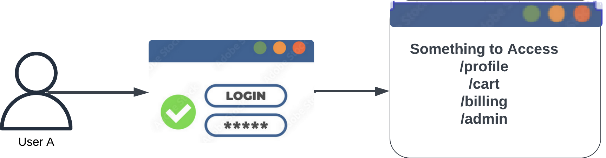
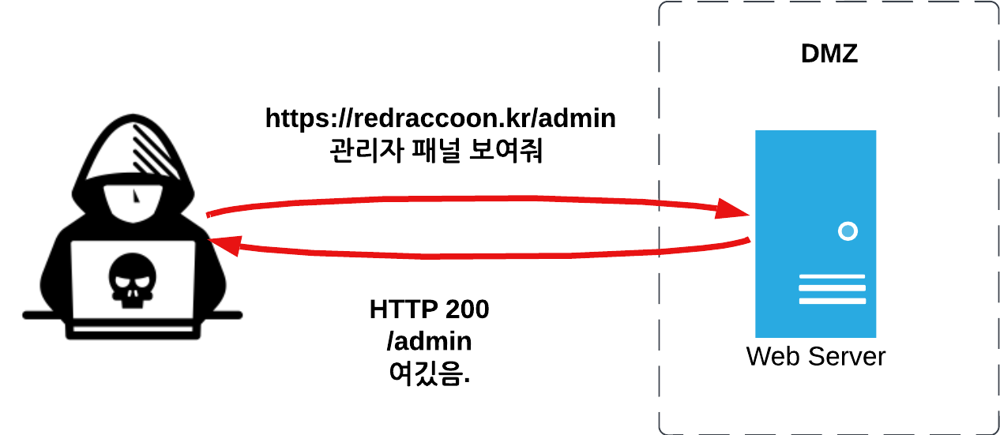
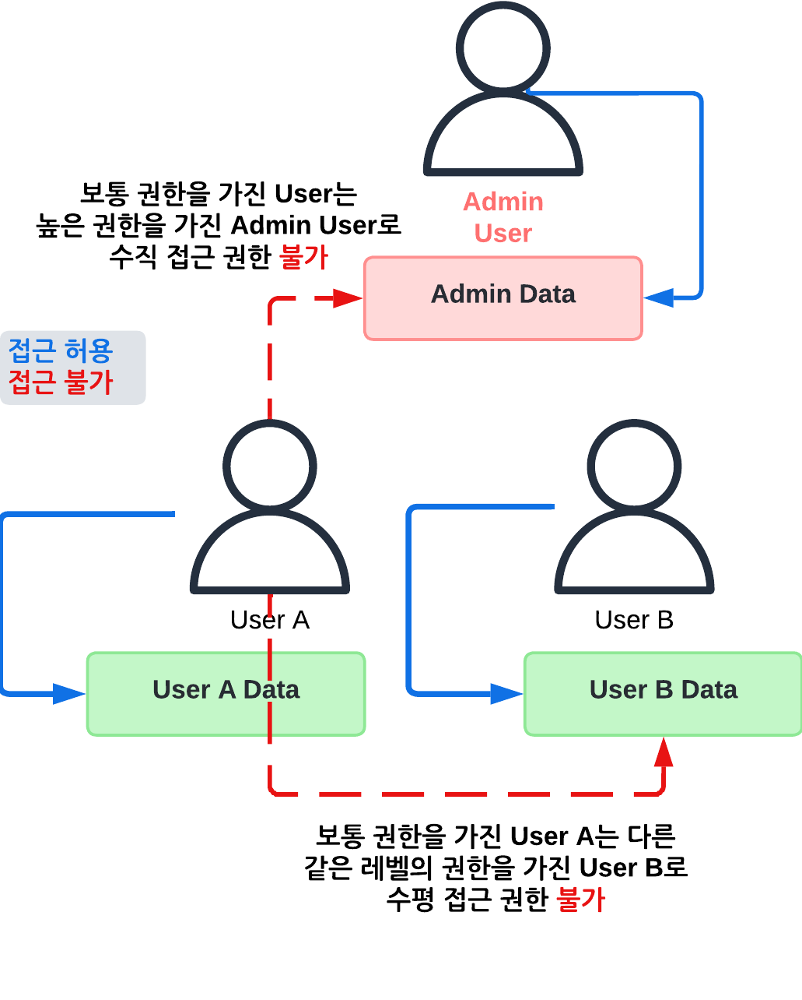
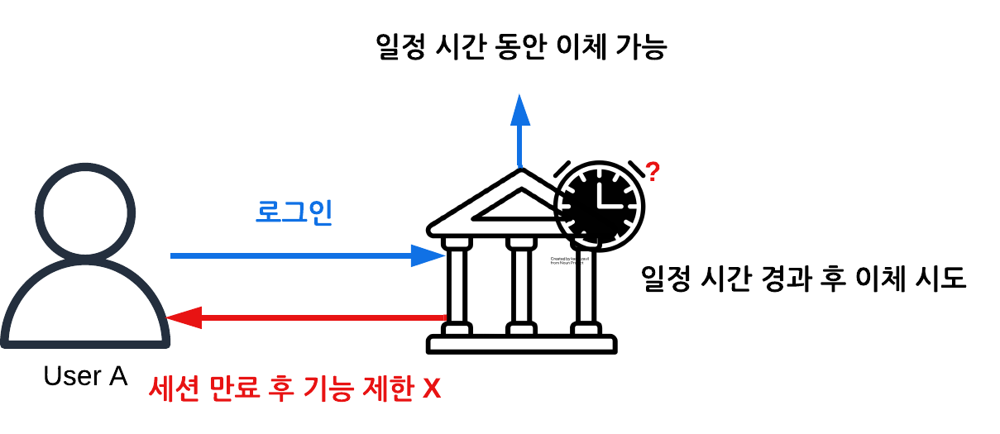

# Web Attack - Broken Access Control 1
본 Web 어택 시리즈는 OWASP Top 10을 기반으로 한 10개의 웹 취약점 및 그에 따른 공격에 대해 하나씩 다룬다. 대부분 모의해커 커리어를 쌓으려면 Web 어택 기술은 기본이니 정확히 이해하고 현직 또는 인터뷰에서 잘 써먹길 바란다. 

## Broken access control 이란?
**Broken access control** (잘못된 전급 제어)란 웹 애플리케이션이 사용자 접근 권한을 제대로 관리하지 못하는 경우 발생하는 웹 취약점이다. 예를 들어 인증된 사용자(Authenticated User)라고 할지라도 허가되지 않은 데이터나 기능에 접근할 수 있게 된다면 Broken, 즉 부러진(망가진? 잘못된? 부르고 싶은데로 부르자) 접근 제어 (Access Control)를 발생시킨다.

간단히 말하면 유저가 웹 서비스 인증후(우리는 이걸 로그인이라 부른다)그 유저가 가진 고유의 접근 권한 외 허가되지 않은 다른 접근을 할 수 있게 된면 망가진 접근 제어라 할 수 있다.




<figure style="text-align:center;">
  
  <figcaption style="margin-top: 10px;">인증 후 유저는 리소스의 접근할 권한이 부여됨</figcaption>
</figure>


아래 다이어그램으로 살펴보자. 

<figure style="text-align:center;">
  
  <figcaption style="margin-top: 10px;">랜덤 유저가 관리자 패널에 접근 가능한 "잘못된 접근" 제어의 예</figcaption>
</figure>

랜덤 공격자는 외부 공격자로서 외부(External)에서 타겟의 내부(Internal)에서도 주로 DMZ에 위치해 있는 웹 서버를 공격한다. 타겟 웹 서버의 도메인 redraccoon.kr의 Sub Directory중 관리자인 admin 유저만 볼 수 있어야하는 /admin 경로가 모종의 이유(예를들어 계속된 야근으로 인해 개발자가 제정신 아닌 상태로 코드를 작성한다든지)로 타겟 웹 서버의 /admin 경로를 성공적으로 (HTTP 200) 볼 수 있는, 즉 잘못된 접근 제어(Broken Access)를 일으켜 웹 취약점이 발생한다.

간단히 말해, 우리집 현관문을 지나가던 나그네가 들락날락하는 상황이라 이해하면 된다. 이렇게 잘못된 접근 제어로 인해 발생하는 잘못된 접근 취약점을 Broken Access Control이라 부른다. 참고로 한국어로는 "잘못된 접근 제어"라고 부르겠다. (I don't know it just makes sense 잘못된?)

## Access Control 종류
Broken Access Control 공격 기법을 설명하기 전에 일단 Access Control의 종류에 대해 알아보자. Access Control의 종류는 크게 세 가지 권한으로 분류할 수 있다.

### 수직 접근 권한 (Vertical Access Control)
수직 접근 권한은 수직적 권한을 가진 유저 사이의 접근 권한을 뜻한다. 아래 다이어그램을 살펴보자. 유저 A는 관리자 권한을 가진 Admin 유저의 대한 접근 제어 권한이 없지만 반대로 Admin은 유저들(A/B)의 데이터에 접근 가능하다. 말 그대로 수직적 (유저 종류 - 보통 유저 vs 관리자 유저) 관계에 따른 접근 제어 방식이다.

### 수평 접근 권한 (Horizontal Access Control)
수평 접근 권한은 수평적 권한을 가진 유저 사이는 접근 권한을 뜻한다.아래 다이어그램을 살펴보자. 동일한 레벨의 유저인 유저 A와 유저B 사이에도 접근이 제한된다. 즉, 한 사용자가 다른 사용자의 리소스에 접근하지 못하도록 하는 접근 제어 방식이다.

<figure style="text-align:center;">
  
  <figcaption style="margin-top: 10px;">수직 접근 제어와 수평 접근 제어의 차이</figcaption>
</figure>


따라서 수직 접근 권한은 상위 권한을 가진 사용자가 하위 권한을 가진 사용자의 데이터에 접근할 수 있도록 하여, 관리와 감독의 목적으로 사용되는 접근 제어 방식이며 수평 접근 권한은 동일한 권한을 가진 사용자들 간의 상호 접근을 제한함으로써, 사용자 간의 데이터를 보호하는 접근 제어 방식이다. 

### 문맥 종속 접근 권한 (Context-Dependent Access Control):

마지막으로 문맥 종속 접근 권한은 사용자의 환경 또는 상황에 따라 접근을 제어한다. 예를 들어, 사용자가 특정 위치에 있거나 특정 시간에만 특정 자원에 액세스할 수 있도록 한다. 예를 들어 User A는 로그인 후 일정 시간이 지나면 이체 기능을 사용할 수 없게된다. 즉, 시간이라는 문맥에 종속되어 조건적으로 접근이 제한되게 된다. 

<figure style="text-align:center;">
  
  <figcaption style="margin-top: 10px;">문백 종속 접근 권한</figcaption>
</figure>


## Access Control 보안 모델
접근 제어 종류에 이어 접근 제어 보안 모델에 대해 알아보자. 접근 제어 모델은 간단히 말해 유저와 리소스간의 접근 제어를 어떻게 부여하고 관리할지에 대한 방법을 의미한다. 

### DAC (Discretionary Access Control)
DAC은 파일의 소유자가 직접 파일의 접근 권한을 제어하는 제어 모델이다. 

> 예를 들어 유저 A가 생성한 파일에 대한 접근 권한은 유저 A가 제어 할 수 있다. 사용자 B에게 권한을 사용자 A가 생성한 파일을 사용자 B에게 읽기 권한을 주고, 사용자 C에게는 쓰기 권한을 준다.


### MAC (Mandatory Access Control)
MAC은 시스템이 전체적으로 접근 권한을 관리하고, 사용자는 이 권한을 변경할 수 없습니다. 

> 예를 들어, 기밀 등급 문서에 대한 접근은 오직 기밀 등급 이상을 가진 사용자만 가능하며, 사용자는 자신의 보안 등급을 변경할 수 없다.

### RBAC (Role-Based Access Control)
RBAC에서는 사용자의 역할(Role)에 따라 접근 권한이 부여된다. 

> 예를 들어 회사 IT 부서에서 '관리자' 역할을 가진 사용자에게는 모든 시스템 설정 변경 권한이 부여되고, '일반 사용자' 역할을 가진 사용자에게는 데이터 조회 권한만 부여된다. 즉 역할 Role에 따라 접근 제어가 결정된다.

### ABAC (Attribute-Based Access Control)
ABAC에서는 사용자, 자원, 환경에 대한 속성(Attributes)에 따라 접근 권한이 결정된다. 

> 예를 들어, 은행 시스템에서 사용자는 평일 오전 9시에서 오후 5시 사이에만 계좌 이체를 할 수 있으며, 사용자는  오후 6시에 계좌 이체를 시도하면 접근이 거부된다.

**진정한 해커?라면 벌써 이마를 딱 쳐야한다. 뭔가 위 특성을 잘 이해하고 활용하면 해킹이 가능하지 않을까?**

## Access Control 취약점 발견하기
취약점을 찾는 방법은 간단하다. 대부분의 모의해킹 프로잭트는 소스코드가 주어지는 WhiteBox 테스팅이기 때문에 해당 접근 제어를 담당하는 소스코드를 잘 살펴보면 된다. BlackBox 테스팅 또한 공격 경우의 수를 테이블로 정리하여 하나하나씩 테스팅하면 된다. 

### 수평 접근 제어 취약점 찾아보기
현 유저 A는 유저 A 리소스에 어떻게 접근하는가? 
그렇다면 유저 A가 유저 A 리소스에 접근하는 방식으로 유저 A로서 유저 B의 리소스를 접근할 수 있는가? 

**수평 접근에 취약한 소스코드**
```
def access_resource(user_id, resource_id):
    user = get_user_by_id(user_id)
    resource = get_resource_by_id(resource_id)
    
    if user_id == resource.owner_id:
        return "successful access"
    else:
        return "no access"
```
위 코드를 살펴보면 유저가 본인 리소스에 대한 접근을 확인하기 위해 유저 ID만 확인한다. 따라서 유저 A가 본인 리소스에 접근하는 방식으로 다른 유저 B의 리소스에도 접근할 수 있게된다. 

### 수직 접근 제어 취약점 찾아보기
현 유저 A는 일반 권한을 가진 사용자인가?
그렇다면 유저 A는 관리자(admin) 권한에 접근할 수 있는가?
만약에 접근 가능하다면 관리자 권한은 잘못된 DAC인가(유저 A만 접근 가능한가) 아니면 잘못된 RBAC인가? (일반 권한을 가진 모든 유저가 접근 가능한가)

**수직 접근에 취약한 소스코드**

```
class User:
    def __init__(self, name, role):
        self.name = name
        self.role = role

class Admin(User):
    def __init__(self, name):
        super().__init__(name, "admin")

def access_sensitive_data(user):
    if user.role == "admin":
        print("you are admin!")
    else:
        print("access denied")
```
위 코드를 살펴보면 매개 변수인 유저의 역할(role)만 확인하여 관리자(admin) 권한을 부여하고 있다. 때문에 아래와 같은 위조 파라미터를 통해 User A의 role을 admin으로 바꿔준다면 유저 A는 admin로서 senstive data에 접근하게 된다.


```
POST /sensitive_data HTTP/2
Host: redraccoon.kr
Content-Length: 38

{"name": "A", "role": "admin"}
```

### 문맥 종속 접근 제어 취약점
현 유저 A는 특정 시간대나 장소(Geolocation)에만 특정 리소스에만 접근할 수 있는가?
그렇다면, 유저 A는 그 특정 시간대에 다른 리소스를 접근할 수 있는가?
또는, 유저A는 다른 시간대에도 해당 특정 리소스에 접근할 수 있는가?

## Access Control 공격 기법 예시

### IDOR 변조
- 목적: URL, ID등을 임의로 바꿔 권한이 없는 리소스에 접근
- 공격 예시:

**HTTP Request**
```
GET /account?userId=<USER_ID> HTTP/2
Host: www.redraccoon.kr
```
**HTTP Response**
- 성공시 200 OK: 요청이 성공적으로 처리되고, 다른 사용자의 프로필 정보가 노출
- 실패시 403 Forbidden: 다른 유저 프로필 접근이 거부

**IDOR 관련 실전랩**:
- Mongo IOR: 
https://pentesterlab.com/exercises/mongo_idor/course

- IDOR to Shell:
https://pentesterlab.com/exercises/idor_to_shell/course

### useSuffixPatternMatch 활성화 취약 - (Spring Framework < 5.3 )
Spring 프레임워크 5.3 미만 버전에서 useSuffixPatternMatch 설정이 기본적으로 활성화되어 있을 경우 `/adminURL`에 매핑된 메서드가 `/adminURL[.].*` 패턴과도 일치하여 URL 필터를 우회할 수 있다.
- 목적: URL의 서픽스 패턴 매칭을 통해 URL 우회를 시도 후 권한이 없는 리소스에 접근
- 공격 예시:

**HTTP Request**
```
GET /adminURL.Raccoon HTTP/2
Host: SpringApp
```

**HTTP Response**
- 성공시 200 OK: adminURL 접근 우회하여 adminURL 패널에 접근 가능.
- 실패시 403 Forbidden: 접근 불가.

### 파라미터 조작 (Parameter tampering) 
- 목적:파라미터 조작하여 권한 없는 리소스에 접근
- 공격 예시:
Referer를 통해 접근 제어를 하는 웹 서버의 경우 Referer 파라미터를 조작하여 높은 권한에 접근할 수 있다. 예를 들어,HTTP Request 헤더에 Referer 헤더에 admin URL을 포함시켜 마치 admin 권한이 요청하는 것처럼 위조할 수 있다.

**HTTP Request**
```
GET /admin/deleteUser HTTP/1.1
Host: redraccoon.kr
Referer: http://redraccoon.kr/admin
User-Agent: Mozilla/5.0 (Windows NT 10.0; Win64; x64) AppleWebKit/537.36 (KHTML, like Gecko) Chrome/91.0.4472.124 Safari/537.36
Accept: text/html,application/xhtml+xml,application/xml;q=0.9,image/avif,image/webp,image/apng,*/*;q=0.8,application/signed-exchange;v=b3;q=0.9
Accept-Encoding: gzip, deflate
Accept-Language: en-US,en;q=0.9
Cookie: session=ABC123
Connection: close
```
**HTTP Response**
```
HTTP/1.1 200 OK
Date: Mon, 07 Jun 2024 12:05:00 GMT
Content-Type: text/html; charset=utf-8
Content-Length: 200
Connection: close

<!DOCTYPE html>
<html>
<head>
  <title>Delete User</title>
</head>
<body>
  <h1>Delete User Page</h1>
  <p>User successfully deleted.</p>
</body>
</html>
```

**파라미터 조작 관련 실전랩**:
- BurpSuite Academy Referer Parameter Tampering:
https://portswigger.net/web-security/access-control/lab-referer-based-access-control


## Broken Access Control 수정 및 (몇가지) 권고사항
1. URL 및 링크 보안: IDOR(IDOR 변조) 공격을 방지하기 위해 URL이나 링크를 통해 민감한 데이터나 기능에 접근할 수 있는 링크를 공개적으로 노출하지 않도록 주의가 필요하다. 또한, 파라미터의 값이나 웹 요청 내용을 검증하여 유효한 권한을 가진 사용자만이 접근할 수 있어야 한다. 

2. Session 토큰 및 Anti-CSRF 토큰 사용: Session 토큰과 Anti-CSRF 토큰을 사용하여 클라이언트 요청 변조를 미리 방지하여 접근 제어 공격을 차단한다. 

3. Security Header: Content Security Policy(CSP) 및 X-Content-Type-Options와 같은 Security Header를 사용하여 위조된 요청을 차단한다.

## Broken Access Control 실전 랩
- [TryHackMe OWASP Broken Access Control](https://tryhackme.com/r/room/owaspbrokenaccesscontrol)
- [WebGoat Broken Access Control A1](https://github.com/WebGoat/WebGoat)
- [DVWA Brute Force](https://github.com/digininja/DVWA)

## 실제 Broken Access Control을 이용한 웹 취약점 사례
1. **Accessing to Data Sources of any Facebook Business account via IDOR in GraphQL**: https://medium.com/@mukundbhuva/accessing-the-data-sources-of-any-facebook-business-account-via-idor-in-graphql-1fc963ad3ecd

2. **WordPress File Sharing Plugin IDOR Vulnerability**: https://www.recordedfuture.com/vulnerability-database/CVE-2023-4836

