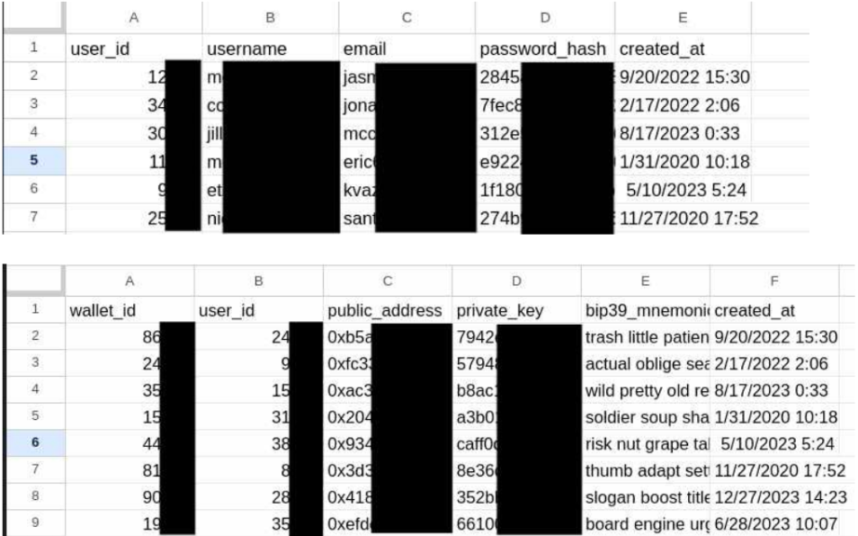

# RPTC 2024

 
레드라쿤 침투테스트 대회(RedRaccoon Penetration Testing Competition, RPTC)는 가상의 암호화폐 회사 코빗웨이브(KobitWave)을 대상으로 목표 기반의 침해가정 내부망 모의침투테스트를 진행하는 대회다. 참여 팀들은 사업제안서 작성, OSINT, 정보 수집, 초기 침투, 권한 상승, 횡적 이동, 후속 공격, 네트워크 피벗, 목표 달성, 보고서 작성, 디프리핑 발표까지, 실무 모의침투테스트에서 진행하는 모든 단계를 비슷하게 진행한다. 대회는 모두 인-캐릭터(In-Character)로 진행되며, 참가자들은 보안업체의 수행인원으로서 대회에 참여하고 대회 운영진들은 코빗웨이브사의 정보보안 팀으로 참여한다. RPTC는 말 그대로 학생들에게 실제 모의해킹 프로젝트를 처음부터 끝까지 체험시켜주기 위한 대회다.  

본격적인 후기에 앞서, 대회와 관련된 정보가 궁금하신 분들은 아래의 링크들을 확인하시면 된다. 

**[대회 패킷](https://docs.google.com/document/d/1NAYtT3EbzqoVMzru9T-uXCKR9aOCdguVNXuj6ScSdJE)**

**[코빗웨이브 RFP](https://docs.google.com/document/d/1tQZ4JUzrA5WCyE8TvSGdQhPtF1AMMYBYY4NZm4DhGtE)**

**예시 Writeup 영상**
- [정보 수집](https://youtu.be/vgu-MSig6Lo)
- [초기 침투](https://youtu.be/VF20oNFGcsY)
- [권한 상승](https://youtu.be/A7wtbOyi79M)
- [네트워크 피벗](https://youtu.be/BprBIK6mr8A)

**[학생팀들의 보고서 및 프리젠테이션](#참여팀-보고서와-발표)**

## 목적 

정보보안 도메인에는 SecOps, 침해사고 대응, 탐지 공학, 악성코드 분석, CTI, GRC, 보안 아키텍쳐 설계, 포렌식, 오펜시브 시큐리티(취약점 점검, 모의해킹, 레드팀, 취약점 연구) 등, 수많은 서브 도메인들이 있고 여기서 파생된 수십, 수백개의 직종들이 존재한다. 하지만 국내 보안 교육은 수많은 도메인 중 하나인 취약점 연구에 특화된 Jeopardy 스타일의 CTF(Capture the Flag)에 치중되어 있다. 개인적으로 CTF는 보안을 배우기 위한 교육 방식 중 가장 재미있고 효율적인 방식이라고 생각한다. 나 조차도 Pico CTF, EkoParty CTF, Google CTF, Boston Key Party, RITSEC CTF 등에 참여하고, 때로는 대회를 운영하며(RITSEC CTF) 많은 것을 배웠으니 말이다. 

하지만 정보보안이라는 거대한 도메인에는 취약점 연구라는 서브도메인만 있는 것이 아니다. 모든 정보보안 직종이 실무에서 문제를 풀며 정해진 정답인 Flag를 찾는 것을 주 업무로 삼고 있지도 않다. 

그렇기에 일반적인 CTF가 아닌 좀 더 오펜시브 시큐리티와 실전 컨설팅에 치중된 대회를 운영해보고 싶었다. 학문적 연구나 문제 풀이 방식의 정보보안이 아닌, 실전 모의침투테스트에 걸맞은 대회를 운영하며 학생들에게 실제 사이버공격이 어떻게 이뤄지에 대해 가르치고, 이를 사전에 찾아내고 막아내기 위한 컨설팅 능력을 길러주기 위해 RPTC를 개최했다. 

## 시나리오 

RPTC 2024는 `코빗웨이브사의 사이버공격 대응 능력을 시험하고 내부망안에서 취약점을 발견해 선제조치를 취하기 위해서 진행되는 모의침투테스트 사업` 이라는 시나리오로 진행됐다. 고객사는 해당 사업에 다음과 같은 목적과 세부 목표들을 설정했다. 

- **목적:** 피싱, 제로데이, Access as a Service, 내부 위협자 등의 방법을 통해 공격자가 코빗웨이브의 내부망 안으로 초기 침투에 성공했다고 가정했을 때, 공격자는 내부망안에서 어떤 공격을 통해 어떤 호스트들을 장악할 수 있으며, 궁극적으로 어떤 데이터들을 유출할 수 있는지를 알아보기 위함. 

사업(대회)의 목적은 위와 같다. 코빗웨이브사의 내부망 안으로 들어온 공격자는, 현실적으로 어떤 공격을 진행할 수 있는가? 어떻게? 코빗웨이브사는 이 공격을 탐지/대응 할 수 있을까? 그리고 위 목적을 달성하기 위해 코빗웨이브에서는 다음과 같은 사업의 목표를 얘기한다: 

- **중요 목표:** 최대한 많은 취약점을 찾아내는 것
    - **세부 목표1:** INTERNAL망 도메인 컨트롤러 모두 장악 
    - **세부 목표2:** MGMT망 C-suite 임원들의 호스트 장악 
    - **세부 목표3:** 접근/탈취 가능한 민감 정보 데이터 및 파일 발견 

## 인프라 

코빗웨이브사의 내부망은 DMZ, INTERNAL, MGMT 3개의 망과 그 안의 웹, 워드프레스, 원격 접속 서버, 파일서버, SCCM, ADCS, 데이터베이스, 액티브 디렉토리, 엔드포인트들이 자리잡고 있다. 

DMZ와 INTERNAL은 VPN망에서 직접적으로 연결 가능하지만, 관리망인 MGMT는 꼭 INTERNAL망을 장악한 뒤 호스트 중 하나에서 관리망으로 네트워크 피벗을 해야 접근이 가능하다. 

## 취약점 

대회 인프라에 심어졌던 취약점은 너무 많아 이 글에서는 다 커버하지 않는다. 심지어 인프라 구축 도중 의도치 않게 취약점이 만들어진 경우도 있었다. 기술적인 취약점이 아니더라도 법이나 컴플라이언스에 적용될 수 있는 잘못된 설정까지 합치면 그 수가 어마어마하다. 따라서 다음의 취약점 리스트는 그냥 참고만 한다. 

**DMZ** 
1. 기본 계정 정보 
2. 취약한 워드프레스 플러그인 - SQLi, RCE, Auth Bypass
3. 취약한 비밀번호 해시 알고리즘 (MD5) 
4. 디렉토리 인덱싱 
5. 민감 파일 노출 -> 직원 유저이름 유출 
6. 과도한 도메인 유저 RDP 권한 

**INTERNAL / 내부망 액티브 디렉토리** 
1. SMB 게스트 세션 허용 
2. MSSQL - 과도한 유저 권한 
3. AS-REPRoasting 
4. Kerberoasting 
5. Authentication Coercion (Petitpotam, Print Spooler)
6. 취약한 LSASS 보안 상태 
7. 약한 비밀번호 
8. 로컬 관리자 계정 비밀번호 재사용 
9. SMB Signing 비활성화를 통한 LLMNR/NBT-NS/mDNS 포이즈닝 공격 
10. LDAP Signing 비활성화 
11. 취약한 비밀번호 정책 
12. ADCS ESC1, ESC4, ESC8 (NTLM 릴레이 공격) 
13. Unconstrained Delegation (+ TGT dump monitoring, auth coercion, etc...)

**MGMT**
1. 민감 파일 노출 
2. Cross-Forest 관리자 비밀번호 재사용 
3. Cross-Forest 과도한 유저 로컬 관리자 권한 
4. 취약한 망분리 상태 

내부망 모의해킹의 묘미는 바로 위 취약점들이 순차적으로 공격 가능한 것이 아니라, 거미줄 마냥 얽히고 섥힌다는 것이다. 즉, 단순 계산으로 따져봤을 때 공격 가능한 공격 경로의 수는 6 * 13 * 4 로, 약 312가지가 된다 (물론 당연히 실제로 312가지는 아니다). 

## 예시 공격 경로 

<em>Logosecurity팀의 공격 경로 다이어그램</em>

위에서 언급했듯이, 모든 공격 경로를 작성할 수 없기 때문에 아래에는 한가지의 예시 공격 경로를 정리해봤다.

**정보 수집 및 초기 침투**

1. 포트스캐닝을 통한 정보 수집 및 대상 파악 
2. Blog 호스트의 취약한 워드프레스 플러그인 공개 취약점 발견 -> 익스플로잇 코드 수정 -> 리버스쉘 획득 
3. 해당 워드프레스가 도커에서 실행중인 것을 확인. 도커 안 파일시스템 중 WP 설정파일에서 백엔드 mysql 유저이름 + 비밀번호 획득 
4. 포트 8081에서 실행중이였던 phpmyadmin에 접근 -> 워드프레스 유저 테이블 덤프 -> 유저 테이블에 존재했던 유저 `kihoon.hong@kr.kw.local`의 비밀번호 해시가 MD5이기 때문에 hashcat을 통해 해시 크래킹. 내부망 유저의 평문 비밀번호 획득. 

**내부망 정보 수집 및 권한 상승**

1. 해당 유저로 블러드하운드 정보 수집 
2. 모든 도메인 유저들이 내부망 파일서버 `fs01.kr.kw.local` 에 로컬 관리자 권한을 갖고 있는 것을 확인.
3. 해당 서버로 KASM, winrm, psexec 등을 이용해 횡적 이동한 뒤, LSASS 덤프 
4. 해당 서버에 접속해 있던 도메인 관리자 `jimin.park@kr.kw.local` 유저의 NT 해시 획득 
5. 도메인 관리자 권한을 이용해 `krdc01.kr.kw.local`에 DCSYNC, 모든 유저들의 NT 해시 획득. 해시크래킹 실행. 
6. `kr.kw.local` 과 `kw.local` 도메인 둘 다 존재하는 유저 이름을 찾기 위해 kerbrute로 커버로스 유저이름 정보 수집 
7. 찾아낸 유저들을 기반으로 비밀번호 재사용 여부를 알아보기 위해 NT 해시 스프레잉 공격 실행 
8. `kw.local` 의 도메인 관리자 중 2~3명이 비밀번호 재사용 -> 포레스트 루트 도메인 장악 

**네트워크 피벗**

1. `kr.kw.local` 및 `kw.local` 에 존재하는 모든 호스트들은 MGMT망으로 접근 가능. 하나의 호스트를 골라 chisel, liogo-ng 등의 프록시 툴 업로드 -> SOCKS 프록시 구축 

2. 프록시를 이용해 MGMT망의 `mgmt.local`에 존재하는 모든 호스트 정보 수집 및 포트 스캐닝 

3. 프록시를 이용해 Cross-Forest 블러드 하운드 정보수집 진행. 포레스트 신뢰 관계가 구축되어 있기 때문에 가능. 

4. 블러드하운드를 통해 특정 `KR, KW` 유저들이 MGMT망의 호스트에 로컬 관리자 권한을 갖고 있는 것을 파악. 해당 호스트들 장악. 임원들 호스트. 

5. 프록시 + 비밀번호 스프레잉을 통해 `kr.kw.local`에 존재하는 도메인 관리자 1명이 `mgmt.local` 도메인에서도 똑같은 비밀번호를 사용하고 있음을 확인. 장악. 

실제 공격이 어떻게 이뤄지는지 영상으로 보고싶으신 분들은 다음의 링크를 확인한다. 

1. 정보 수집 - [https://youtu.be/vgu-MSig6Lo](https://youtu.be/vgu-MSig6Lo)
2. 초기 침투 - [https://youtu.be/VF20oNFGcsY](https://youtu.be/VF20oNFGcsY)
3. 권한 상승 -  [https://youtu.be/A7wtbOyi79M](https://youtu.be/A7wtbOyi79M)
4. 후속 공격 및 네트워크 피벗 - [https://youtu.be/BprBIK6mr8A](https://youtu.be/BprBIK6mr8A) 

## 업무 과제 

실무를 뛰다보면 고객사에서 추가적인 일을 줄때가 있다. 예를 들어 AD 장악에 성공했다면 회사의 비밀번호 관리 서버를 장악해보라던지, 새롭게 설치된 EDR 솔루션을 우회해보라던지, 온프레미스 장악을 기반으로 PRT등을 빼내 클라우드 자산들에 접근을 해보라던지, 등. 

이런 추가적인 과제를 RPTC에서는 `Inject - 업무과제` 라는 섹션으로 진행해봤다. 1일 1업무과제를 팀들에게 전달했는데, 이는 다음과 같다: 

**1. 자산식별** - 학생팀들을 돕기위한 힌트이자, 실제로 받아본 경험이 있다. 현재 발견하고, 접근 가능하며, 모의해킹 중인 네트워크 및 호스트 IP주소와 이름을 정리해 제출

**2. 악성코드 리버싱** - 네트워크 안에서 발견된 수상한 파일. 고객사는 `이거 모의해킹 팀거예요?` 라고 궁금해하며 파일을 던져준다. 컨설턴트로서 리버싱을 통해 악성코드 안의 숨겨진 .NET 어셈블리를 찾고, 복호화 시퀀스 및 하드코딩된 암호를 찾아 숨겨져 있던 데이터를 복호화한 뒤, 복호화된 쉘코드가 어떤 종류의 쉘코드인지 찾아내야한다. 

**3. 페이로드 개발** - 코빗웨이브가 새롭게 설치한 AV 솔루션을 평가 하기 위해 참여팀들은 페이로드를 개발해 `10.2.20.201` 호스트에 설치된 솔루션을 우회한 뒤, LSASS에 저장되어 있는 TGT를 덤프해야한다. 

참여 팀들 중 페이로드 개발 (#3번 인젝트)를 잘 수행해준 팀이 있었다. VirtualAlloc + RtlCopyMemory + CreateThread를 사용하는 간단한 로더였지만, 업무 과제를 받은지 24시간 안에 쉘코드 변환, 로더 제작, AV 우회를 보여줬다는 것 자체가 매우 고무적이였다. XOR 암호화로 쉘코드를 숨긴 것도 좋았다. 

## 보너스 시나리오...? 

대회를 좀 더 재밌게 하기 위해 보너스 시나리오도 몇 개 넣어봤다. 이를 모두 찾아낸 팀은 1개의 팀 밖에 없었다. 

**1. 이미 공격 당한 코빗웨이브?**

`10.2.20.101`, 외부망에서 원격 접속 솔루션을 이용해 접근 가능한 내부망 파일서버의 도메인 관리자 데스크톱을 보면 수상한 `beacon.exe` 파일을 찾을 수 있다. 파일명이 `beacon` 인 것을 보면 코발트스트라이크의 에이전트일 수도 있지만, 다른 종류의 파일일 수도 있다. 해당 악성코드를 발견한 학생들은 어떻게 고객사에게 소통했을까? 

Secumaster팀이 좋은 반응을 보여줬었다. 파일 분석 후 해당 파일에 관련된 내용을 신속하게 보고한 것이다. 고객사 동의 없이 인터넷 샌드박스 서비스에 업로드 한 것은 아쉽지만, 이걸 찾아내 능동적으로 보고했다는 것 자체가 굉장히 고무적이였다. 

**2. 영업비밀 유출을 계획중인 임원**

관리망의 임원 엔드포인트에 가보면 특정 임원의 데스크톱에서 여러개의 폴더를 발견할 수 있다. 폴더들에는 영업비밀 유출 관련된 판례문, 연구 등을 찾을 수 있고, 더 들어가다 보면 `chrismas-present.zip` 이라는 암호화된 압축파일을 찾을 수 있다. 그리고 비밀번호 사전공격을 통해 공격하면 다음과 같은, 매우 수상한 파일들을 찾아낼 수 있다: 

C-suite 임원 중 하나가 회사가 관리중인 모든 암호화폐 지갑, 유저 정보, 개인정보, 암호화폐 거래 정보를 다른 경쟁사에게 빼돌릴 준비를 하고 있다라는 시나리오다. 

물론 실무에서 이런 일이 일어날 리는 없고, 대회를 위해 재미로 만든 시나리오다. 

## 참여 팀들 - 잘한 점 

국내에서 처음으로 이뤄지는 모의침투테스트 형태의 대회에, 웹과 모바일 모의해킹이 아닌 네트워크 및 액티브 디렉토리 기반의 침투테스트였기 때문에 학생팀들이 고전할 것이라고 예상했었다. 뿐만 아니라 중간 중간에 페이로드 개발, 악성코드 분석 등의 추가적인 기술적 지식도 필요했기 때문에 쉽지 않았을 것이라 생각했다. 

기술적인 외에도 최종 보고서 작성, 디브리핑 프리젠테이션 발표, 인-캐릭터 보안업체 수행인원으로서 실제 현업자처럼 행동하고 결과물을 작성하는 것 또한 쉽지 않았을 것이라고 생각했다. 

하지만 많은 학생팀들이 좋은 모습을 보여줬다. 네트워크 정보수집, AD 기반의 공격등의 기술적인 일부터, 보고서의 양식이라던지 인-캐릭터 프리젠테이션을 하면서도 긴장하지 않은 모습을 보여주는 등, 학생이라고 보기 어려울 정도로 뛰어난 모습을 보여준 팀들이 많았다. 

그러나 역시 우리나라에서는 거의 처음으로 열린 대회고, 생소한 개념들이 많았기 때문에 조금 부족했던 점들도 있었다. 내년 RPTC에서는 더 많은 학생들이 더 좋은 모습을 보이고, 더 발전할 수 있도록 부족했던 점들도 몇 가지 짚고 넘어가려한다. 

## 참여 팀들 - 부족했던 점 

### 능동적 마음가짐, 능동적 컨설팅

RPTC는 시작점과 도착지점, 2개의 지점을 주고 그 사이를 컨설팅 및 모의침투테스트라는 방식으로 채워가는 형식의 대회다. 시작점은 고객사가 제공한 RFP 및 패킷에 적혀있고, 도착지점은 고객사가 정해준 목적 및 목표라고 볼 수 있다. 그 사이를 메꿔가기 위해서 학생들은 계획을 수립하고, 각 단계별로 모의해킹을 실행하며, 도착 지점에 가서는 이 여정을 보고서와 발표를 통해 고객사에게 설명할 수 있어야한다. 

아무래도 이런 형식의 대회가 처음이다 보니 많은 팀들이 조금 혼란스러웠던 것 같다. `뭐해야 되나요? 뭐 풀어야 하나요? 문제/챌린지 없나요?` 등의 질문을 받다보면, 아무래도 능동적 문제해결이 생소한 참여팀들이 있었다는 것을 느낄 수 있었다. 

### Pwn2Own 

이런 형식의 대회들을 진행하면서 느끼는 거지만, 많은 수의 학생들이 모의해킹을 여전히 pwn2own으로 생각하고 있다. 최대한 많은 잘못된 설정과 취약점을 찾으려는게 아닌, 오로지 `뚫고` `쉘 따기`를 하기 위해 모의해킹을 진행하는 것을 볼 수 있었다. 소수의 팀들을 제외하고는 대다수는 특정 호스트에서 취약점을 찾고, 해당 취약점을 이용해 후속 공격이나 횡적이동을 할 수 있으면 바로 다음 호스트로 넘어가 공격을 진행한 것을 볼 수 있다. 

이런 점은 보고서와 발표에서 특히 많이 보였다. 많은 수의 팀들이 하나의 호스트에서 1개의 취약점이나 잘못된 설정을 찾았다. 실무 모의해킹은 CTF처럼 정해진 답이 1개가 있지 않다. Pwn2Own처럼 오로지 `이기기` 위해서 모의해킹을 진행하지도 않는다. 고객사에게 최대한 많은 가치를 전달하기 위해서는 최대한 많은 취약점과 잘못된 설정을 찾아야하고, 대상 호스트들을 대상으로 전반적인 점검을 할 수 있도록 노력해야할 것이다. 

### 보고서 & 발표 

고객사에게 전달되는 최종 결과물인 보고서와 디브리핑 발표는 가장 중요한 결과물들이다. 몇백만원, 몇천만원을 사용해서 최종적으로 고객사가 얻는 것은 보고서 PDF 파일과 디브리핑 발표니까 말이다. 그런 의미에서 고객사에게 중요한 부분이 누락된 보고서나 발표가 많았던 것이 아쉬웠다. 

목적과 목표 기반의 모의침투테스트라면, 고객사의 입장에서는 공격자들의 공격 기법, 방식, 단계들에 대한 궁금증이 있을 것이다. 공격자들이 어떤 방식으로, 어떻게, 어떤 호스트들을 공격하면, 어떤 비즈니스적 리스크를 유발할 수 있는가? 에 대한 궁금증에서 이런 종류의 프로젝트들이 실행되기 때문이다. 

하지만 꽤나 많은 수의 보고서들은 취약점 스캐너를 돌린 것 처럼 보고서에 취약점들밖에 없는 경우가 많았다. AI나 스캐너 툴들로 찾아낼 수 있는 취약점이 아닌, 사람만이 찾아낼 수 있는 창의적인 공격들과 공격 경로, 기법, 취약점, 리스크 등을 총괄하는 분석이 들어간 보고서는 찾기 어려웠다. 

디브리핑 발표 또한 보고서를 PPTX 발표로 전환시킨 발표들이 많았다. 취약점과 관련된 기술적인 내용이 있는 것 자체는 나쁘지 않으나, 발표들이 너무 취약점에만 치우쳐져 모의침투테스트 디브리핑이라기 보다는 스캐너 결과물 발표라는 느낌이 들었다. 좀 더 침투테스트와 비즈니스적 리스크를 강조하고, 정말 중요한 높음/심각 위험도의 취약점에 치중한 발표를 들었다면 더 좋았을 것 같다. 

## 그럼에도 불구하고

그럼에도 불구하고, 참여한 모든 팀들이 엄청 잘해줬다. 국내에서 생소한 실무 형식의 대회에, 생소한 오펜시브 시큐리티 도메인 (AD, 내부망, 네트워크, 등), CTF 플래그가 아닌 보고서 및 발표라는 생소한 결과물을 만들어내야 하는 대회임에도 불구하고 많은 팀들이 굉장히 잘해줬다. 

## 앞으로의 계획 

RPTC는 레드라쿤이 존재하는 한 계속 열릴 것이다. 내년에는 학생팀들에서 나아가 일반인팀들도 받을 예정이다. 일반인 팀들중에는 직장인 팀들도 있을테니, 대회에서 더 나아가 국내 레드팀/공격자 시뮬레이션 위주의 컨퍼런스나 세미나로 성장하면 좋을 것 같다.  

그러기 위해서는 현재 옷장 속에서 돌아가고 있는 개인 홈랩 머신보다는 좀 더 큰 하드웨어가 필요하거나, 클라우드에 인프라를 구축해야할 것이다. 만약 이 대회 및 컨퍼런스/세미나를 성장 시키는데에 관심있는 기업/개인 분들이 계시고, 스폰서가 가능하시다면, 언제든지 `admin@redraccoon.kr` 로 연락 부탁드린다.

## Special Thanks 

RPTC 2024는 다음의 분들의 도움으로 무사히 진행될 수 있었다. 이 블로그 글을 통해 감사의 말씀을 전해드린다. 

- [groot](https://www.redraccoon.kr/about/)
- [min](https://www.redraccoon.kr/about/)
- [타쿠대디](https://takudaddy.tistory.com/)
- [yoobi](https://velog.io/@yoobi/about) 
- 심야
- 거오
- [Ludus](https://ludus.cloud)

RPTC는 미국 유학중 참여했던 [CPTC](https://cp.tc/)의 대회 형식을 빌려 진행한 대회다. 이 자리를 빌려 CPTC와 해당 진행위원 분들에게도 감사의 말씀을 전한다. 

## 참여팀 보고서와 발표

다음은 RPTC에 참여한 학생 팀들 중, 공개를 허락한 팀들의 보고서와 발표다. 대학생 1~4학년생 학생들이 24~48시간 안에 쉬지않고 작성한 결과물이니, 너무 엄격한 잣대를 들이밀지 않으셨으면 좋겠다. 

보고서와 발표는 다음과 같은 이유 때문에 공개한다: 

1. 참여 학생들의 공개적 포트폴리오로 활용해 취업/인턴쉽 등에 도움이 되기 위함 

2. 미래 RPTC에 참여할 팀들을 위한 레퍼런스 

3. 모의해킹 및 모의침투테스트 보고서 양식이 궁금한 학생들을 위해

### LOGOSecurity - 1등 

- [보고서](https://drive.google.com/file/d/1FC2KNi0-iMcNiGyiuqkcXQ2UB2WnPPMd/view)
- [발표](https://drive.google.com/file/d/1j8JP4G1Y3A_m3Etlh_aoudJw-rSQ1Nt1/view)

- 순천향대학교 김동언
- 순천향대학교 정다윗
- 순천향대학교 이상현 

### SecuMaster - 2등 

- [보고서](https://drive.google.com/file/d/1_ClrrVcqJK9x2g3ew42U48nDMgzByMrr/view) 
- [발표](https://drive.google.com/file/d/1CBletcWX-AplCK5tcmRyXEtf88bVl0pi/view) 

- 목표대학교 박정준
- 목표대학교 송희원
- 목표대학교 이준호 

### 롤로노아랄뚜기 - 3등 

- [보고서](https://drive.google.com/file/d/1gq9OkyOlU9W_hE9T-2uZ6QM9J2bkWch7/view)
- [발표](https://docs.google.com/presentation/d/e/2PACX-1vQBJX7wWth3ufiVAspCkY7jTSuoo2AICrn50SFsuUXStGJ1_P_6NwRw9ZWBrrIfim1dj_vlEe18cJLH/pub?start=false&loop=false&delayms=3000)

- 수도포병여단 668대대 김도현 
- 대구대학교 추상원

### 레드도그 
- [보고서](https://drive.google.com/file/d/1g70JsJiVhFfK1U07r31SPQw2oXkiit8W/view)
- [발표](https://docs.google.com/presentation/d/e/2PACX-1vQot_G8vdjyzSuqI7PFuZLVGWYZqCaRNXyRXODHS9OOl4iy7WMwnaeenRqWMNipDA/pub?start=false&loop=false&delayms=3000) 

## 마치며 

이렇게 RPTC 2024를 마친다. 참여해준 모든 학생들, 도움 주신 심사위원 분들, 레드라쿤 커뮤니티 멤버 & 운영진까지, 모든 분들께 감사하다. 그럼, 2025년에도 RPTC를 진행할 수 있기를 바라며...

Happy Hacking! 