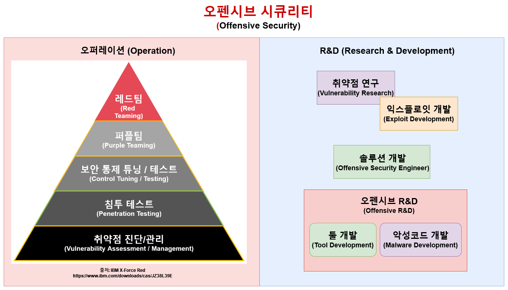

# 오펜시브 시큐리티 서비스 용어 정리 

## 들어가기 앞서 

최근 오펜시브 시큐리티(Offensive Security)에 대한 관심이 급증하면서, 다양한 용어가 뒤섞여 사용되고 있다. 업계 내외에서 쓰이는 용어가 다르고, 국내와 해외 에서 서로 다른 용어를 사용하며 혼란을 초래하는 경우가 많다. 

이 글에서는 국내와 해외에서 사용하는 오펜시브 시큐리티 업계 내의 용어들과 그 차이점에 대해 알아본다. 이 글을 통해 혼란을 줄이는데 도움이 되었으면 한다. (왠지 그 반대가 될 수도 있겠다 싶다)

## 근본적인 문제점 

<figure style="text-align:center;">
  
</figure>

IT, 정보보안, 오펜시브 시큐리티 자체는 해외에서 시작됐기 때문에 대부분의 용어가 영어로 이뤄져 있지만, 국내에서 사용하는 영어 기반 용어들은 해외에서 더 이상 사용되지 않거나 콩글리쉬 인 경우가 있다. 그렇다고 해서 영어로 된 용어들을 한글로 그대로 번역해 사용하면 그 의미가 애매해지는 경우도 있다. 

예를 들어 데프콘에 간 국내 컨설팅 기업 소속 웹 모의해커와 해외 레드티머 간의 대화가 이렇게 흘러갈 수도 있다. 

> 만나서 반가워요! 어떤 일 하세요? 

저는 컨설팅 회사 레드팀(Red team) 소속 화이트해커(White Hacker) 입니다. 주로 웹해킹(Web hacking)을 전문적으로 하고 있어요. 

> 오 레드팀! 이번에 NightHawk에 탑재된 User Defined Reflective Loader 보셨어요? EDR 솔루션 다 우회했거든요! 

아, 저는 APT 공격(APT Attack) 서비스는 하지 않고, 웹해킹만 주로 하고 있어요. 

> (APT 공격이 뭐지 레드팀인가) 그럼 웹 침투테스트 (Web penetration test / Web pentest) 를 하는거군요. 침투 테스터(Penetration Tester)인거네요. 

아니요, 침투까지는 안해요. 웹 모의해킹 (Web Ethical/Mock Hacking)만 하고 있어요. 

(침투테스트면 APT 공격 같은거 아닌가? 나는 웹에서 취약점만 찾아서 보고하지, 실제로 침투까지는 안하는데... )

> 모의해킹...? 아, 그냥 오펜시브 시큐리티(Offensive Security) 부서 소속으로 웹 침투테스트(Web Penetration Testing)만 하시는거네요 

(오펜시브 시큐리티? 제로데이 찾는거 아닌가?) 취약점 연구나 제로데이 연구 같은 건 잘 안해요. 오로지 웹만! 

> ??? 

???

이렇듯, 서로 사용하는 용어가 다르기 때문에 대화가 이뤄지기가 어렵다. 레드팀, 오펜시브 시큐리티, 제로데이 연구, 모의해킹, 모의침투테스트 ... 뭐가 뭔지 헷갈리니, 이 글을 통해 한 번 정리해보자. 

## 오펜시브 시큐리티 서비스

정보보안 업계가 커지고 오펜시브 시큐리티 도메인도 성장해감에 따라 오펜시브 시큐리티 서비스들의 종류 또한 늘어났다. 크게 보자면 실무 위주의 오퍼레이션(Operation)이 있고, 연구 개발 위주의 R&D가 있다. 이와 관련된 용어들에 대해서 아래에서 더 자세히 다뤄본다. 

국내와 해외에서 사용하는 용어들의 차이 또한 알아봐야 한다. 예를 들어 아래 표는 국내와 해외에서 각기 다르게 사용되는 용어들이다. 표에 나오는 용어들은 업계 기준으로, 미디어에서 나오는 정보보안 뉴스나 비기술적인 인원들과 소통할때는 여전히 비기술적인 용어들("화이트해커", "크래커", "블랙햇")을 사용할 때도 있다.  

| 국내    | 해외     |
|-------|--------|
| 화이트해커 | 더 이상 사용 안함  |
| 화이트햇, 블랙햇, 그레이햇, 크래커, 등 | 더 이상 사용 안함 | 
| 레드팀   | 오펜시브 시큐리티 (Offensive Security)      |
| 취약점 진단/관리 | 취약점 진단/관리 (Vulnerability Assessment/Management)
| 제로데이 연구      | 취약점 연구 (Vulnerability Research)       |
| 모의해킹 | 침투 테스트 (Penetration Test) | 
| 모의해커 |  침투 테스터 (Penetration Tester)      |
| APT 공격      |  레드팀, 공격자 시뮬레이션 (Red Team, Adversary Simulation)      |

다음 섹션에서는 각 용어들에 대한 설명 및 국내와 해외의 차이점에 대해서 알아본다. 용어들 자체는 해외(미국) 기준으로 설명한다. 

## 오펜시브 시큐리티 (Offensive Security) 
전반적인 공격형 정보보안 서비스 및 업계를 나타내는 일반적인 용어. 취약점 진단, 취약점 연구, 각종 모의침투테스트, 레드팀, 퍼플팀등의 모든 서비스들이 포함됨. 

- **국내:** 국내에서 오펜시브 시큐리티는 제로데이 취약점을 발견하고 이를 공격하는 익스플로잇을 제작하는 취약점/익스플로잇 연구(Vulnerability/Exploit Research)를 지칭할때가 많다. 

- **해외:** 해외에서는 말 그대로 Offensive Security, 공격형 보안을 통틀어 지칭하는 용어로 사용된다. 

## 취약점 진단/관리 (Vulnerability Assessment/Management)
(주로) 자동화된 스캐너를 실행해 내부망/외부 등의 네트워크, 웹/앱 등의 개별 어플리케이션, 혹은 클라우드 등에서 취약점을 찾아내는 서비스. 업계에서는 Nessus, AppScan, Qualys, Rapid7 InsightVM 등이 사용된다. 취약점 발견시 익스플로잇은 대부분 진행하지 않으며, 스캐너의 결과를 바탕으로 취약점을 취합 한 뒤, 개선하는데 초점을 맞춘다. 

## 취약점/익스플로잇 연구 (Vulnerability/Exploit Research)
특정 대상을 상대로 취약점 및 제로데이 취약점을 찾아내는 서비스. 공공쪽의 경우 프로젝트와 수주 기관에 따라서 취약점을 찾아낸 뒤 이를 공격하는 익스플로잇 개발까지 같이 진행되는 경우가 있다. 

- **국내:** 국내에서는 "제로데이 연구" 라는 용어가 사용될때가 있다. 

- **해외:** 해외에서는 취약점 연구 (Vulnerability Research) 라는 용어가  많이 사용된다.  

## 침투테스트 (Penetration Test / Pentest)
국내에서 흔히 말하는 `모의해킹`. 웹, 모바일 앱, 내부망, 외부망, IOT, OT/SCADA, 와이파이, 클라우드, 자동차, 선박, 물리 등, 생각할 수 있는 모든 분야를 상대로 진행된다. 공격자의 관점에서 특정 타겟을 상대로 공격을 진행해 기술적 취약점을 찾고, 이를 보고하는 서비스다. 

- **국내:** 국내에서 모의침투테스트라는 용어는 레드팀(공격자 시뮬레이션)을 지칭할때가 많다. 

- **해외:** 해외에서는 국내에서 사용하는 `모의해킹` 용어 대신 `XYZ Penetration Testing`(예. Web pentest, Cloud pentest, Internal network pentest, 등...)을 사용한다. 

### 레드팀 및 공격자 시뮬레이션 (Red Team / Adversary Simulation)
대상의 관리적, 기술적 보안을 담당하는 인력, 절차, 기술 (People, Process, Technology) 등의 전반적인 현황과 부족한 간극을 평가하기 위해 실제 공격자들의 공격 라이프사이클과 전략, 전술, 절차를 에뮬레이트(emulate), 혹은 시뮬레이트(simulate) 한 가상의 사이버 공격을 진행하는 서비스

- **국내:** 국내에서 레드팀은 오펜시브 시큐리티, 즉, 공격형 보안을 통틀어 지칭하는 용어로 사용된다. ex) 5년차 레드티머(red teamer) 채용 - 주 업무: 웹해킹 

- **해외:** 해외에서 레드팀의 정의는 위와 같다. 다만 레드팀이라는 용어 자체도 HR과 마케팅쪽에서 오펜시브 시큐리티의 의미로 사용하자 업계에서는 레드팀이라는 용어 대신 `공격자 시뮬레이션`으로 전환하고 있는 추세다. 

### 수행 인원을 나타내는 용어
- **국내:** 화이트해커, 레드티머 등의 일반적인 용어 사용 
- **해외:** 해외의 경우 수행하는 업무에 따라 용어가 조금씩 바뀐다. 참고로 각 나라나 회사마다 용어가 조금씩 다르니 유의한다. 
    - 취약점 연구원(Vulnerability Researcher)
    - 익스플로잇 개발자(Exploit Developer)
    - 침투테스터(Penetration Tester)
    - 레드티머(Red Teamer)
    - 오펜시브 시큐리티 엔지니어(Offensive Security Engineer): 오펜시브 시큐리티 관련 솔루션을 개발하거나, 오퍼레이션이나 R&D 중 툴 개발, 악성코드 개발, 유지보수, C2 개발등을 전문적으로 하는 인원 

## 이런 용어들은요? 

### 화이트해커 

90년대, 00년대 이후로 외국 업계에서는 사용되지 않는 용어다. 가끔 뉴스나 정보보안과 관련된 비기술적인 블로그 글, SNS 글에서 가끔 보이지만 업계에서는 사용하지 않는다. 

## 화이트햇, 블랙햇, 그레이햇 등의 XYZ-Hat 

90년대, 00년대 이후로 외국 업계에서는 사용되지 않는 용어다. 가끔 뉴스나 정보보안과 관련된 비기술적인 블로그 글, SNS 글에서 가끔 보이지만 업계에서는 사용하지 않는다. 

## 해커, 크래커 등의 공격자 구분법 

90년대, 00년대 이후로 외국 업계에서는 사용되지 않는 용어다. 가끔 뉴스나 정보보안과 관련된 비기술적인 블로그 글, SNS 글에서 가끔 보이지만 업계에서는 사용하지 않는다. 

## 윤리적 해킹 등의 도덕과 관련된 용어 

90년대, 00년대 이후로 외국 업계에서는 사용되지 않는 용어다. 가끔 뉴스나 정보보안과 관련된 비기술적인 블로그 글, SNS 글에서 가끔 보이지만 업계에서는 사용하지 않는다. 

### 모의해킹 (Ethical/Mock Hacking) 

90년대, 00년대 이후 외국 업계에서는 사용되지 않는 용어다. 가끔 뉴스나 정보보안과 관련된 비기술적인 블로그 글, SNS 글에서 가끔 보이지만 업계에서는 사용하지 않는다. 

국내의 `OO 모의해킹` 은 외국의 `XX Penetration Testing` 으로 사용되고 
있다. 예) 웹 모의해킹 / 웹해킹 == Web Penetration Testing

## 마치며 

과거 정보보안 업계가 제대로 시작되기 전, 미디어에서 악의적인 개개인의 공격자들을 설명할 때 사용됐던 "블랙햇 해커" 라던지 "크래커" 같은 용어가 2024년 기준 여전히 업계에서 사용되는 있는 것은 안타깝다. 국내보다는 좀 더 업계가 성숙한 해외에서는 어떤 용어들이 업계에서 사용되고 있는지 알아본 뒤, 국내에서 사용하는 용어들 또한 한 번 정립하는 것이 좋을 것 같아 글을 작성해봤다. 위 용어들이 오랫동안 사용됐기 때문에 하루 아침에 바뀌진 않을테지만, 그래도 혼란을 어느정도 줄이는데 도움이 되었길 바라며, 

Happy Hacking! 
