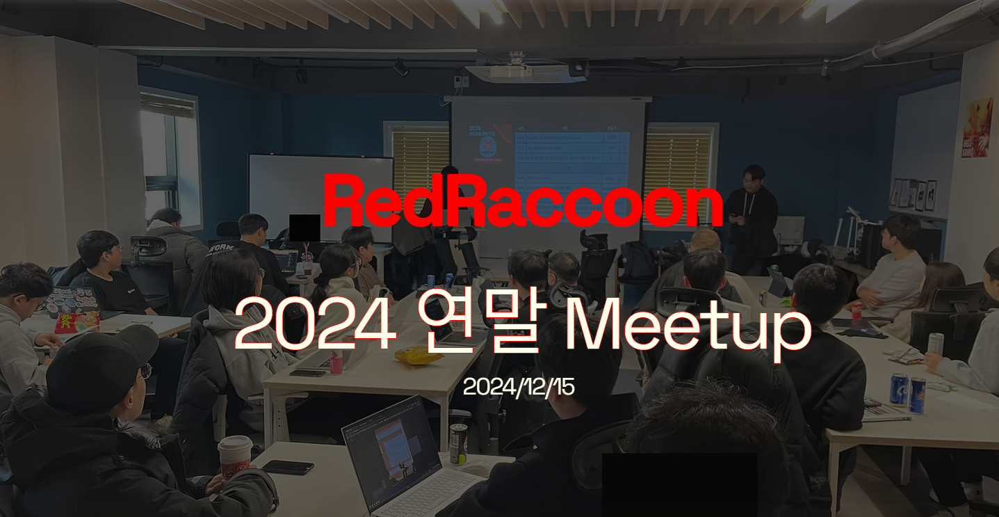
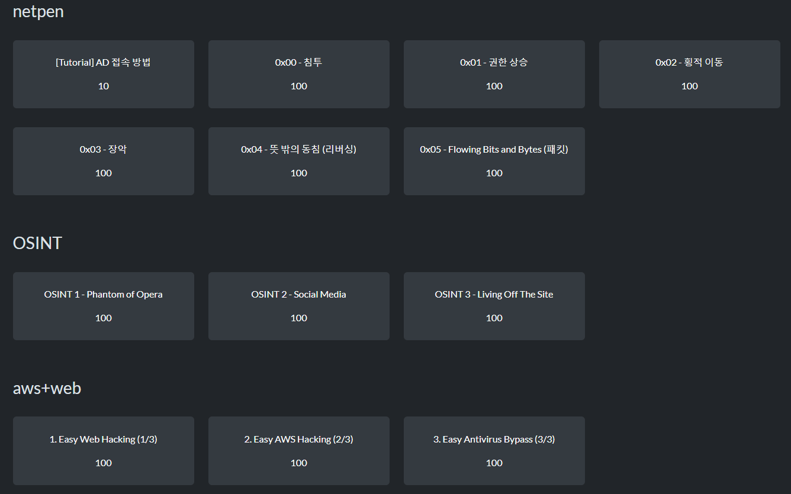

# 2024 연말 밋업

레드라쿤 2024 연말 밋업(Meetup)은 정보보안 실무(오퍼레이션, Operation)에 대한 관심을 높이고, R&D와 실무 간 균형을 되찾는 데 기여하고자 기획된 이벤트다.

정보보안 도메인에는 취약점 연구(VR: Vulnerability Research)뿐만 아니라 SecOps, 침해사고 대응, 탐지 공학, 악성코드 분석, CTI, GRC, 모의해킹, 레드팀/침투테스트, 취약점 점검, 포렌식, 보안 아키텍처 설계 등 다양한 오퍼레이션 관련 서브도메인과 직종이 존재한다. 하지만 국내에는 VR과 익스플로잇 개발에 초점이 맞춰진 학계와 소수의 연구자를 제외하면, 실무 중심의 컨퍼런스나 밋업이 거의 없는 상황이다. VR도 중요한 분야지만, 한 국가의 정보보안 및 오펜시브 시큐리티 생태계가 단일 분야에 지나치게 편중되는 것은 균형 발전에 부정적인 영향을 줄 수 있다.

정보보안은 지난 30년간 엄청난 발전을 이루며 다양한 서브도메인을 만들어냈고, 각 분야는 보안 업계와 학계에서 중요한 역할을 담당하고 있다. 각 분야의 실무자와 학생들이 모여 자신의 연구, 경험, 그리고 네트워킹을 공유할 수 있는 장을 마련하는 것이 중요하다고 생각했다. 이러한 생각을 바탕으로 레드라쿤 연말 밋업은 현업 종사자와 관심 있는 학생들이 함께 모여 경험을 공유하고 네트워킹하며 함께 발전할 수 있는 자리를 제공하기 위해 기획되었다.

# 발표 및 토크

다양한 실무 분야에 종사하는 (혹은 종사할) 분들을 위해 발표자들의 토크도 다양한 주제를 포함했다. 보안이라는 특성상 세부적인 내용을 공개할 수는 없지만, 아래는 이번 밋업에서 진행된 발표 및 토크의 주제들이다:

- 미국에서의 침투테스트 War Story
- 인하우스(In-house) 레드팀 설립 과정
- 국내 모의해킹 및 침투 경험
- 위협 인텔리전스(CTI: Cyber Threat Intelligence) 및 오펜시브 CTI 소개
- 커널 취약점 발견 여정

기술적으로 깊이 있는 내용부터 어디에서도 듣기 어려운 경험담, 그리고 국내에 잘 알려지지 않은 분야(CTI, 오펜시브 CTI 등)까지 다양한 도메인의 주제들이 다뤄졌다. 실무자들에게는 새로운 분야를 소개하고, 학생들에게는 간접적인 실무 경험과 실제 실무에서 요구되는 기술적 및 비기술적 지식을 제공한 소중한 시간이었다고 생각한다.

# CTF

운영진의 시간이 부족해 CTF를 크게 준비하지 못했지만, 색다른 분야의 Jeopardy 스타일 CTF를 기획했다.

- **Netpen**: VPN을 통해 AD 환경에 접근해 전체 AD 환경(포레스트 + 2 도메인)을 장악하고, Loader 리버싱 및 C2 네트워크 트래픽 분석
- **OSINT**: DLL 리버싱, 공격자 인프라 URL 파악, 실제 APT가 사용한 SNS 계정 기법 추적, LOTS 활용
- **Web + AWS**: SSRF, EC2 메타데이터, AWS SSM IAM role을 악용한 코드 실행, EC2 정보 수집 및 디펜더 우회 후 Credential Dumping

난이도와 상관없이 실제 APT 그룹과 사이버 공격/방어에서 사용되는 기법을 최대한 많이 포함하고자 노력했다. 재미 삼아 말하자면, 이 챌린지들을 모두 엮으면 실제 공격 체인을 만들 수도 있다(OSINT -> Web -> Cloud -> EC2 장악 -> AD 피벗 -> 온프레미스 AD 장악).

이처럼 국내에서는 다소 생소할 수 있는 분야에서도 Jeopardy 스타일 CTF를 운영할 수 있음을 보여주고자 색다른 방식으로 기획했다.

# 레드라쿤 멤버분들 

저번 RPTC 대회 이후 오랜만에 레드라쿤 멤버분들을 뵜고, 학생이 아닌 실무자 멤버 분들은 거의 처음으로 뵙는거라 감회가 새로웠다. 발표할 때 질문들도 많았고, 쉬는 시간이나 이벤트 시작 전, 후로도 따로 모여 네트워킹을 하는 모습을 보며 이런 좋은 분들이 모인 커뮤니티를 운영할 수 있어 복 받았다고 느꼈다. 

# 개선할 점

레드라쿤에서 처음 진행한 밋업 이벤트였기 때문에 여러모로 아쉬운 점과 개선할 부분이 많았다. 그럼에도 많은 분들이 좋은 피드백을 주셔서 감사할 따름이다.

개인적으로 가장 아쉬웠던 점은 소통할 시간이 부족했다는 것이다. 이번 행사의 취지가 기술적인 내용이나 연구보다는 실무자와 학생들의 네트워킹에 초점을 맞췄지만, 정작 서로 이야기를 나눌 시간이 충분하지 않았던 것 같다. 내년에는 발표 시간을 줄이고, 자유롭게 이야기를 나누거나 CTF를 함께 푸는 등 소통할 시간을 더 늘릴 예정이다.

# 내년을 기약하며

그럼에도 불구하고 레드라쿤 2024 연말 밋업은 성공적으로 마무리되었다. 참석해주신 40여 명의 레드라쿤 커뮤니티 멤버분들과, 이름이나 핸들을 공개할 수는 없지만 발표를 맡아주신 3분의 멤버에게 진심으로 감사드린다.

앞으로도 다양한 분야에서 재미있는 해킹/보안 이야기를 나눌 수 있는 공유의 장이 많아지길 기대하며,

**Happy Hacking!**

--- 

# Special Thanks to 

레드라쿤 2024 연말 밋업은 [HSPACE](https://hspace.io/)의 장소 지원 덕분에 성공적으로 진행될 수 있었다. HSpace는 정보보안과 IT와 관련된 인재들을 위한 [해커스페이스](https://wiki.hackerspaces.org/)를 국내에 만들어 제공하고 있다. 

해커스페이스는 IT 및 보안/해킹에 관련된 지식을 배우고, 네트워킹 하고, 놀고, 실습하기 위한 장소다. 개인적으로 몇 년 전 Liveoverflow 유투브 채널에서 독일 해커들은 자기 동네에 있는 해커스페이스에 가서 IT, 해킹, 하드웨어에 관련된 공부를 한다는 것을 보고 엄청 부러웠었는데, 우리나라에서도 HSpace가 이런 장소 및 문화를 만들어 나가고 있다. 

HSpace의 홈페이지에는 현재 진행중인 스터디, 강의, 프로젝트 등이 있고, 관련된 커뮤니티 디스코드나 카카오톡 방도 있기 때문에 관심 있는 분들은 [홈페이지](https://hspace.io/)로 가시면 된다. 

HSpace의 김종민 대표님의 도움으로 이번 밋업은 HSpace의 장소에서 성공적으로 진행할 수 있었다. 다시 한 번 감사의 말씀을 드린다. 